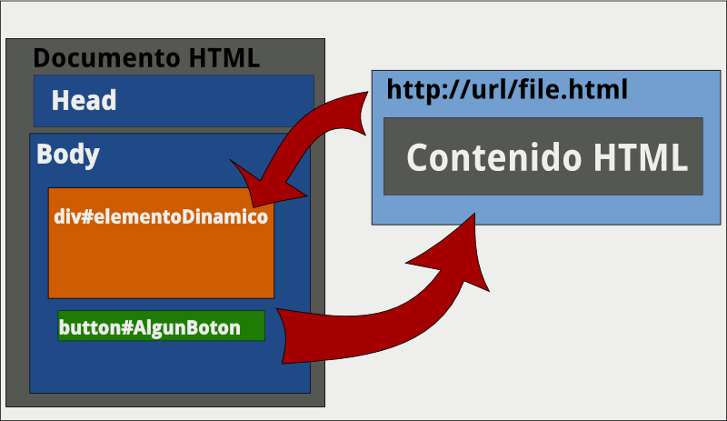

Sesión 5 - Ajax.
=============================================================================

## Ajax.

**Ajax**, acrónimo de Asynchronous JavaScript And XML (_JavaScript asíncrono y XML_), es una técnica de desarrollo web para crear aplicaciones interactivas o RIA (Rich Internet Applications). Estas aplicaciones se ejecutan en el cliente, es decir, en el navegador de los usuarios mientras se mantiene la comunicación asíncrona con el servidor en segundo plano. De esta forma es posible realizar cambios sobre las páginas sin necesidad de recargarlas, lo que significa aumentar la interactividad, velocidad y usabilidad en las aplicaciones.

En concepto parte del hecho que desde javascript podemos realizar solicitudes( _httpRequests_ ) y que por medio que _javascript_ no espera el resultado de dicha solicitud para continuar su flujo.

## Ajax y Jquery.

Personalmente siento que el concepto es algo confuso con **jQuery**, ya que propiamente no se deberia llamar `ajax` si no HttpRequest ó simplemente Request ([como funciona en mootools](http://mootools.net/docs/core/Request/Request)).

En adelante cuando se mencione `ajax` en la jerga de **jQuery** nos referimos a una funcion de jQuery que realiza un **http request**, espero que quede mas claro con algunos ejemplos:

#### Ejemplo básico

	$.ajax({
		url: 'ajax/test.html',
		success: function(data) {
			$('.result').html(data);
			alert('Load was performed.');
		}
	});

### Quitando la opción asincrona.

Observe el siguiente código.
	
	var datos  = null;
	$.ajax({
		url: 'ajax/test.html',
		success: function(data) {
			datos = data;
		}
	});
	console.log(datos);

Datos sera `null`, ya que la respuesta es asincrona es decir `console.log()` no espera la finalización de `$.ajax` para ejecutarse, hacer `async` igual a `false` resulta una opción util para esta logica.

	var datos  = null;
	$.ajax({
		url: 'ajax/test.html',
		//detiene la ejecución.
		async : false,
		success: function(data) {
			datos = data;
		}
	});
	console.log(datos);	

Otra opción para esperar que ajax se haya ejecutado para realizar determinada acción seria encaminar la funcion `done` como se muestra acontinuación.

	var datos  = null;
	$.ajax({
		url: 'ajax/test.html',
		success: function(data) {
			datos = data;
		}
	}).done(function( msg ) {
		console.log(datos);}
	);

#### Ejemplo Manejando el error.

Si somos detallistas nos daremos cuenta que `console.log(datos);` no garantiza que los datos no sean nulos, pues la respuesta puede llegar a fallar y en este caso tal vez deseamos rellenar a datos con valores por defecto.

	var datos  = null;
	$.ajax({
		url: 'ajax/test.html',
		success: function(data) {
			datos = data;
		}
		error: function() {
			datos = {v1:'valor defecto 1', v2:'valor defecto 2'};
		}
	}).done(function( msg ) {
		console.log(datos);}
	);

## Otras funciones Ajax

Existen otras funciones definidas para manejar respuestas asincronas para una detallado mas extenso se recomienda consultar la categoria **Ajax** de la api de **jQuery**:

## getScript

Es una función `ajax` de **jQuery** equivalente a:

	$.ajax({
		url: url,
		dataType: "script",
		success: success
	});

A partir de **jQuery** `1.5` puedes ocupar la función `.fail()` para detectar y manejar errores.

	$.getScript("ajax/test.js")
	.done(function(script, textStatus) {
		$( "div.log" ).text( textStatus );
	})
	.fail(function(jqxhr, settings, exception) {
		$( "div.log" ).text( "Triggered ajaxError handler." );
	});

[Ejemplo - getScript](../ejemplos/05.getScript.html)

## getJSON

Esta función es en particular muy util ya que varios servicios por Internet nos brindan una API y por lo regular los datos son enviados en formato json.

<http://api.jquery.com/jQuery.getJSON/>

[Ejemplo - getJson y la API de youtube](../ejemplos/05.getjson.html)

[Ejemplo - getJson y la API de Flickr](../ejemplos/05.get_json.html)

[Ejemplo - getJson y la API de twitter](../ejemplos/05.getjson.twitter.html)

## Ejemplo load

Entre las funciones que ofrece **jQuery** para el control asincrono esta la función  [`load`](http://api.jquery.com/load/) dicha función se encarga de cargar algun contenido obtenido desde alguna url, para entender mejor esta función observe el siguiente esquema:

El esquema enterior muestra un documento **Html** el cual contiene un **div** identificado como `elementoDinamico` el cual va a cargar el contenido de `http://url/file.html` en el momento que hagan click sobre el botón identificado como `algunBoton`, bien ahora veamos como quedaria este ejemplo:

	//relacionamos el evento click del boton #algunBoton
	$('#algunBoton').click(function(event) {
		//En el div #elementoDinamico vamos a cargar el contenido de file.html
		// Notar que el parametro que recibe puede ser una url absoluta o un ruta refenenciada.
		$('#elementoDinamico').load('file.html');	
		// Detenmos los demas eventos(si no hacemos esto subiria el scroll)
		event.preventDefault();
	});

Probar ejemplo: <a id="algunBoton" href='javascript:;' >algunBoton</a>

 - <http://api.jquery.com/category/ajax/>
 - [Usando herramientas de calidad de código - por Anton Kovalyov (_inglés_)](http://anton.kovalyov.net/slides/gothamjs/)
 - [Principios para escribir JavaScript consistente e idiomático](https://github.com/rwldrn/idiomatic.js/tree/master/translations/es_ES)

